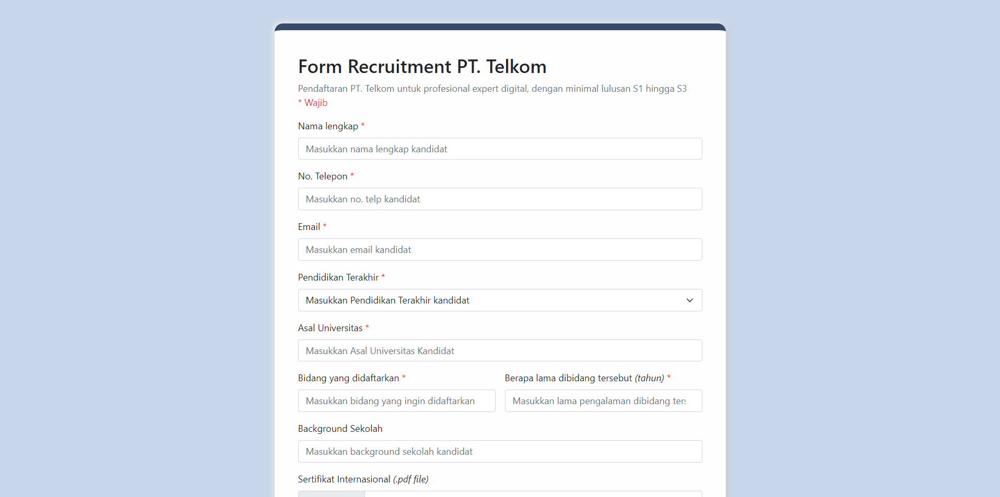
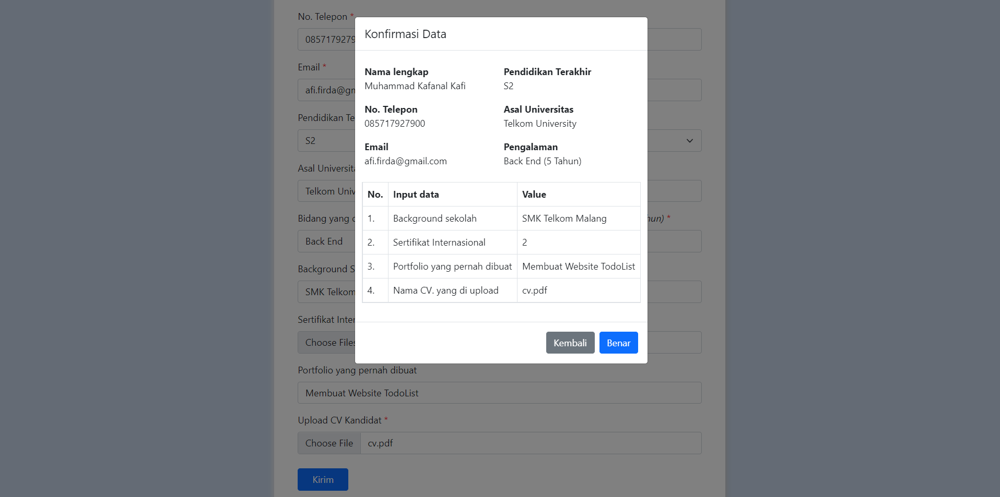
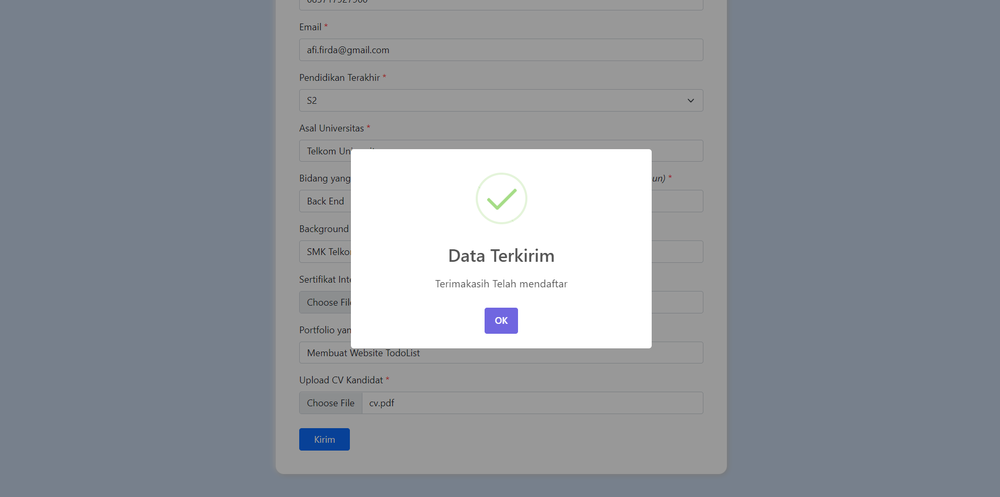

# Form Recruitment PT. Telkom

Form pendaftaran kandidat PT. Telkom untuk profesional expert digital, dengan minimal kelulusan S1 hingga S3

## Fitur validasi yang ada

- Validasi untuk Email
- Validasi untuk No. Telepon
- Validasi untuk pembatasan upload CV sampai 500 kB

## Documentation

- Page form

- Page Confirm

- Page Success

## Technology

- HTML
- CSS
- JS
- Bootstrap
- SweetAlert2

## Link

[Link Website](https://kkafi09.github.io/tefa-dbt-project/ujian-tefa-chapter2/index.html)

[Link Documentation](./documentation/Kelompok4_Documentation%20Tugas%20Besar%20Chapter%202.pdf)

## Our Temas

- Kafi -> Develop Web
- Zidane -> Documentation (Google Document)
- Gizel -> Desain Wireframe and Mockup
- Yasmin -> Desain Wireframe and Mockup

## Credit

> Kelompok 4 TEFA SMK Telkom Malang
